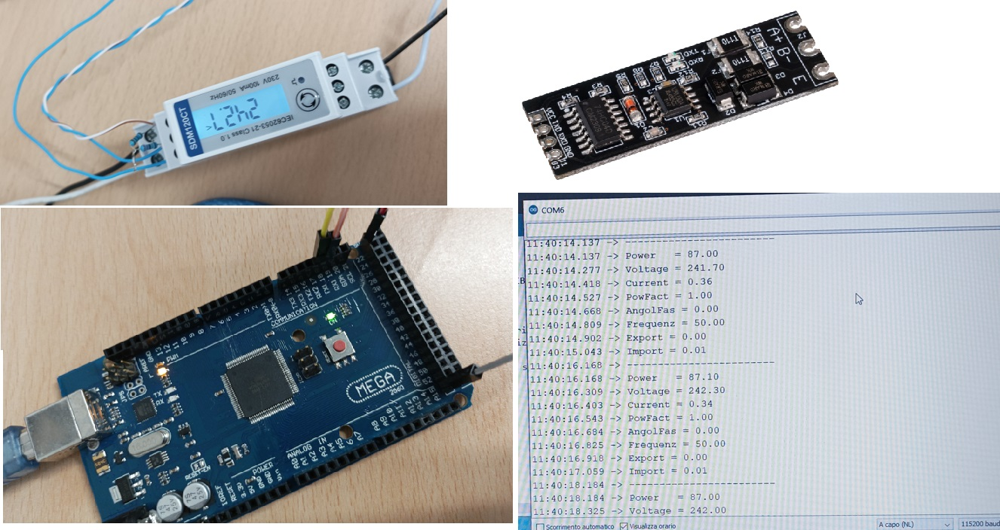

# ApSDM120
Library for interfacing meter SDM120 with Arduino

A direct approach to the meter is used without the need to know the Modbus protocol, an approach paradoxically more robust than some Modbus libraries I tried before writing this!

Sample code and usage guide, very simple read :

